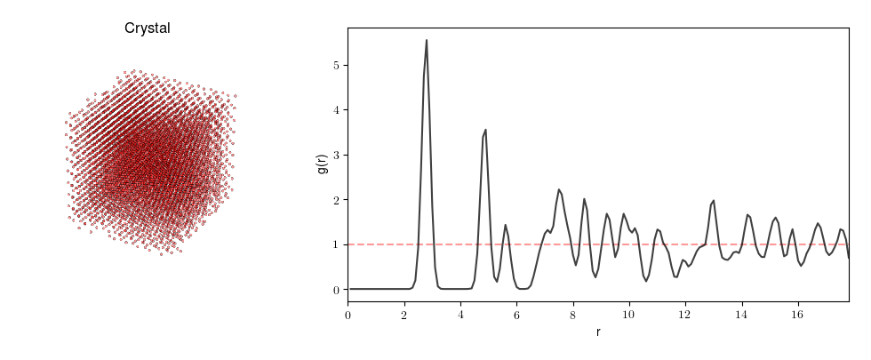

# rdfpy

rdfpy is a Python package for computing fast 2D and 3D radial distribution functions. 




## Installation

```shell
$ pip install rdfpy
```

## Usage

```python
import numpy as np
from rdfpy import rdf3d

particles = np.random.uniform(0.0, 10.0, size=(1000, 3))  # random particles in a 10x10x10 box

g_r, radii = rdf3d(particles, dr=0.1)
```

## Authors

[Batuhan Yildirim](http://www.mole.phy.cam.ac.uk/people/by.php)

## License

[](http://badges.mit-license.org)
