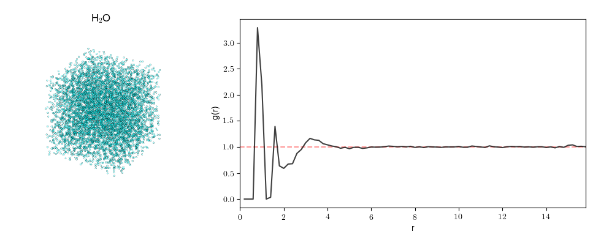

Introduction
============

The radial distribution function (RDF) (or pair correlation function) characterises the structure of a 
system of particles. If we select an arbitrary particle as the origin, the RDF describes the number of 
particles we would observe relative to the bulk density of the system, as a function of distance. 
This is calculated and averaged over every particle in the structure being considered. The formal 
definition of the RDF is 

.. math::
    g_{i}(r) = \frac{n_{i}(r)}{4 \pi r^{2}\delta r \rho}

where :math:`n_{i}(r)` is the number of particles between distances :math:`r` and :math:`\delta r`, 
and :math:`\rho = \frac{N}{V}` is the number density. Dividing by :math:`\rho` ensures that the RDF 
is centred around 1 when the density of particles observed at some distance does not deviate from the 
bulk density. Two examples of (1) a highly-ordered crystalline system and (2) a short-range ordered 
liquid are shown.

|pic1| |pic2|

.. |pic1| image:: ../../rdfpy/examples/crystal.png 
   :width: 49%

