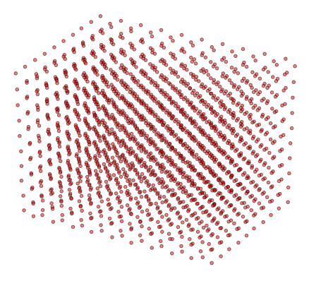
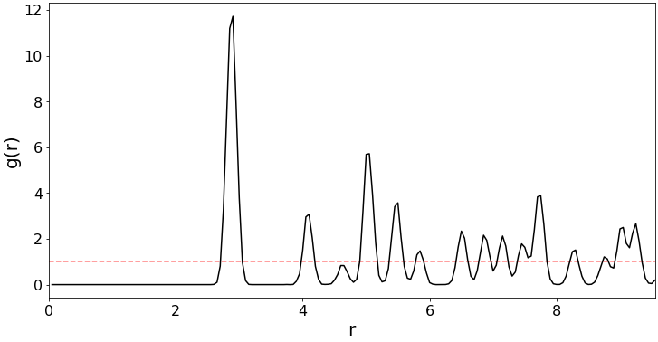

Introduction and Examples
=========================

What are Radial Dsitribution Functions?
--------------------------------------

The radial distribution function (RDF) (or pair correlation function) characterises the structure of a 
system of particles. If we select an arbitrary particle as the origin, the RDF describes the number of 
particles we would observe relative to the bulk density of the system, as a function of distance. 
This is calculated and averaged over every particle in the structure being considered. The formal 
definition of the RDF is 

.. math::
    g_{i}(r) = \frac{n_{i}(r)}{4 \pi r^{2}\delta r \rho}

where :math:`n_{i}(r)` is the number of particles between distances :math:`r` and :math:`\delta r`, 
and :math:`\rho = \frac{N}{V}` is the number density. Dividing by :math:`\rho` ensures that the RDF 
is centred around 1 when the density of particles observed at some distance does not deviate from the 
bulk density. 

Example: RDF of a Crystal Structure
-----------------------------------

In this example, we use **rdfpy** compute the RDF of Crystalline Ti. The Crystallographic Information 
File (CIF) can be obtained from `here <https://materialsproject.org/materials/mp-46/#>`_, 
and is provided by the  `Materials Project <https://materialsproject.org/>`_. First we import the ``rdf3d`` 
function from **rdfpy**, as well as pymatgen for obtaining atom coordinates from the CIF file, and numpy.

We then load the structure and create a supercell so that there are enough atoms in the crystal to compute 
an RDF from. Also, to make the resulting function smoother, we add some noise to the coordinates.

.. code-block:: python

   import numpy as np
   from rdfpy import rdf3d
   from pymatgen import Structure

   structure = Structure.from_file('/home/by256/Downloads/Ti_mp-46_computed.cif')
   structure.make_supercell(10)

   coords = structure.cart_coords
   coords = coords + np.random.normal(loc=0.0, scale=0.05, size=(coords.shape))

Finally we use **rdfpy** to compute the RDF from the coordinates, specifying the step size parameter ``dr``:

.. code-block:: python

   g_r, radii = rdf3d(coords, dr=0.05)

Plotting ``g_r`` against ``radii`` results in the following function.

